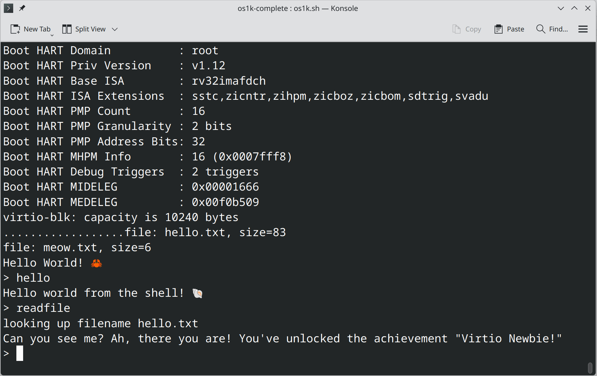

# Writing an Operating System in (more than) 1,000 Lines in Rust

I am new to Rust and operating systems. I wanted to learn as much as I could from the excellent guide written by Seiya Nuta and this is the result. It comes it at just over 1,300 lines, but I didn't want to cut this down too much further by using tricks that made the logic less clear.

As I went I (re) wrote Seiya's guide, which you can find here **([https://github.com/tews-code/operating-system-in-1000-lines/en](https://github.com/tews-code/operating-system-in-1000-lines/blob/main/website/en/01-setting-up-development-environment.md))**.

My guide covers setting up Rust, using Cargo, and tying it all together with a simple build script.

The actual guide (in C) is here 
**[English](https://1000os.seiya.me/en)** ∙ **[日本語](https://1000os.seiya.me/ja/)** ∙ **[简体中文](https://1000os.seiya.me/zh/)** *(translated by [@YianAndCode](https://github.com/YianAndCode))* ∙ **[한국어](https://1000os.seiya.me/ko/)** *(translated by [@JoHwanhee](https://github.com/JoHwanhee))* ∙ **[繁體中文](https://1000os.seiya.me/tw/)** *(translated by [@alanhc](https://github.com/alanhc))*

This repository contains the source code for the website [Operating System in 1,000 Lines](https://1000os.seiya.me/), and a reference implementation.

## More interesting implementations

Let me know if you have implemented something interesting!
